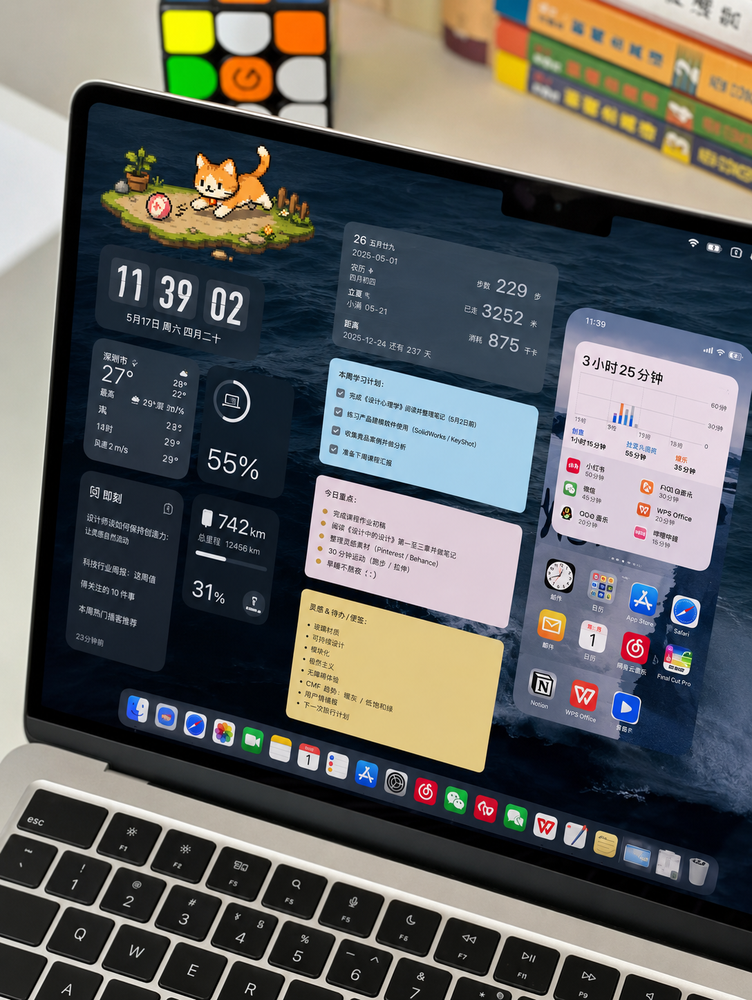
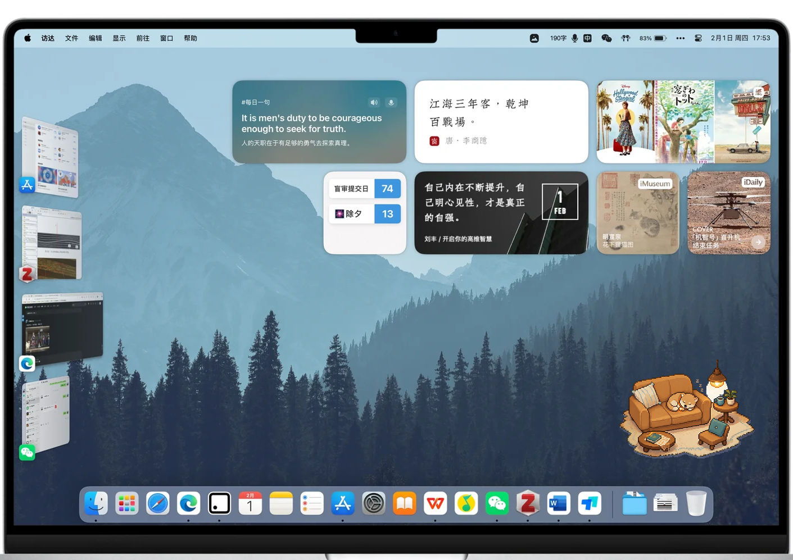
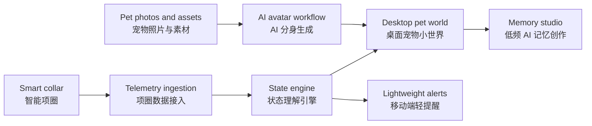
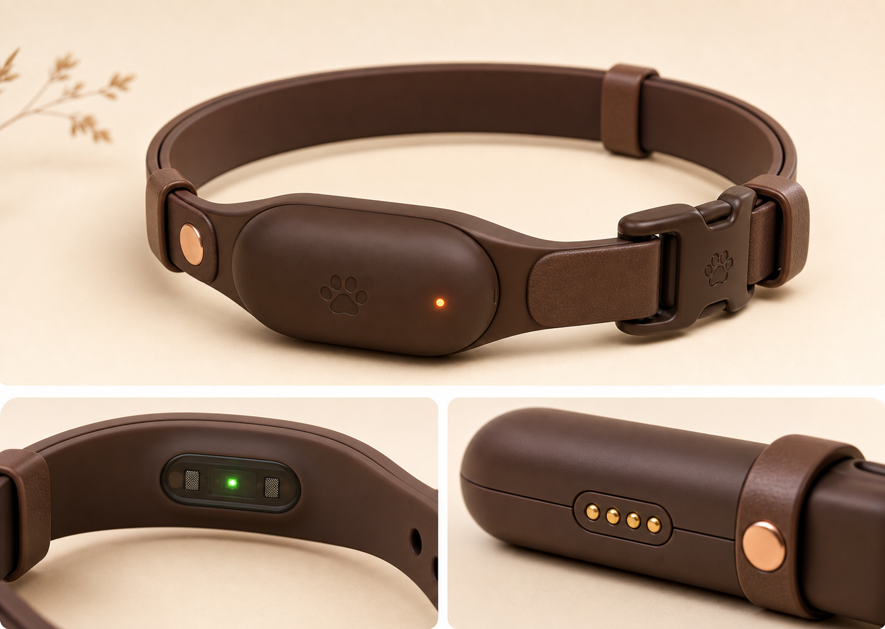
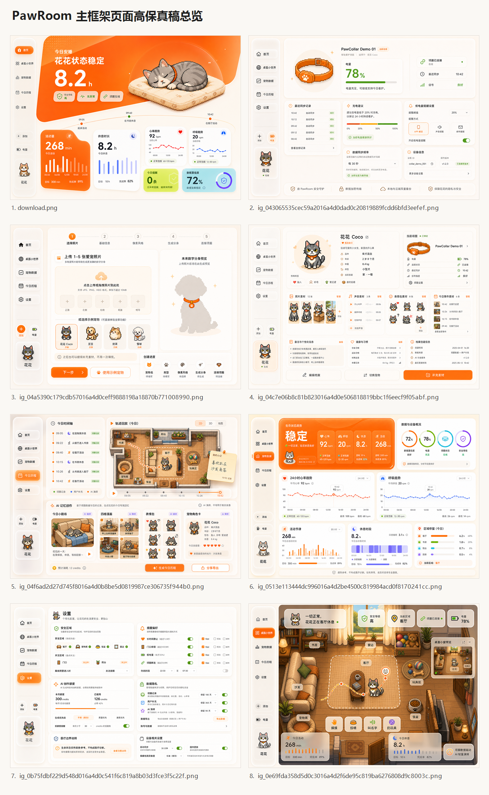
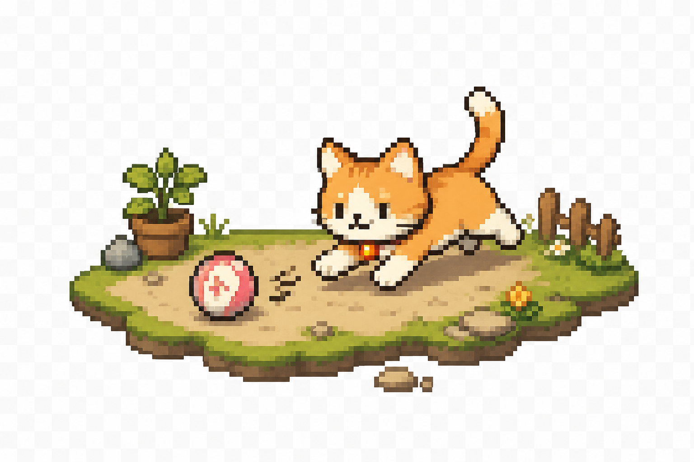
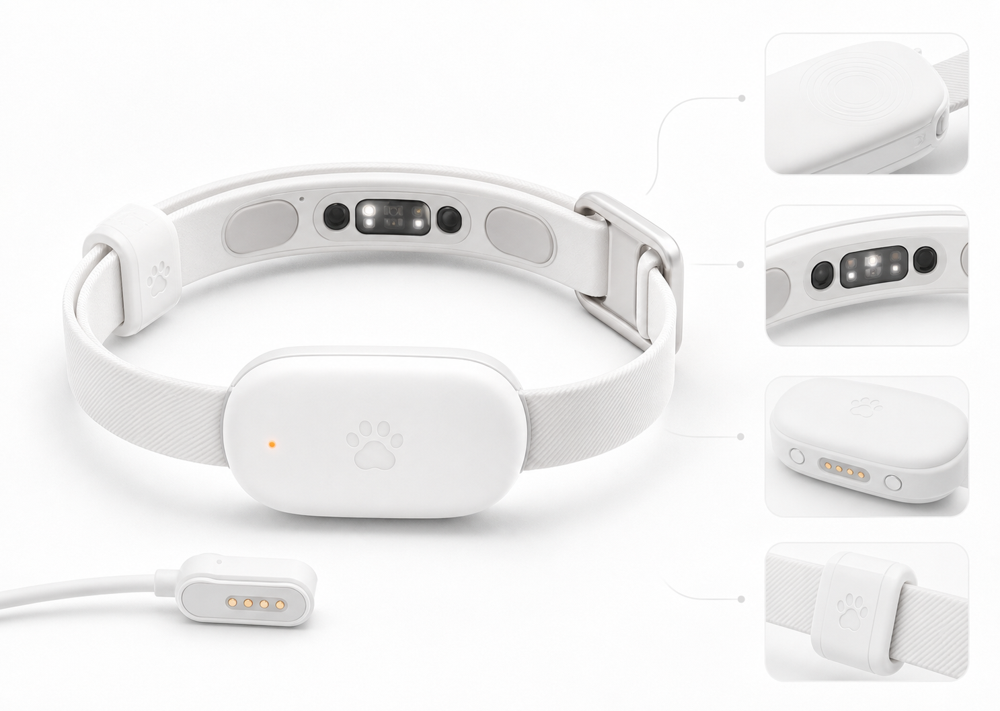

# PawSentinel AI Collar Monitor

**PawSentinel 是一个软硬件一体的 AI 宠物安全看护系统。**  
It combines smart-collar telemetry, a backend state engine, a desktop companion world, and lightweight alerts to make pet safety monitoring more understandable and emotionally acceptable.



> 当前仓库以软件 MVP 为主，用模拟项圈数据验证“硬件采集 -> 后端理解 -> 软件展示 -> 互动反馈”的完整链路。早期文档中出现的 PawRoom 或 PawGuard 均指向同一产品方向，最终公开名称统一为 **PawSentinel**。

## Product Demo / 产品演示视频

[](docs/assets/demo/pawsentinel-product-demo.mp4)

**[Open product demo video / 打开产品演示视频](docs/assets/demo/pawsentinel-product-demo.mp4)**

Click the image above to open the product demo video.
点击上方图片可查看 PawSentinel 产品演示视频。

## 中文项目介绍

PawSentinel 面向需要远程看护宠物的上班族和学生。传统宠物监控通常依赖摄像头和冷冰冰的数据图表，用户虽然能“看到”宠物，却很难快速理解宠物是否安全、是否异常、今天在家经历了什么。

PawSentinel 的思路是把智能项圈采集到的活动区域、运动状态、电量、休息趋势和生命体征趋势，转换成清晰的安全状态、提醒事件和可互动的桌面宠物小世界。用户在电脑上看到的不是复杂数据，而是卡通化的宠物分身、家庭地图、状态气泡、低电量提醒、活动轨迹和可选的记忆创作内容。

其中“宠物分身”不是默认模板角色，而是用户上传自己宠物的照片、声音或素材图后，通过 AI 图像工作流转译成卡通化、像素化的专属形象。这个分身会继续承接项圈数据，在桌面小世界里表现宠物当前的安全状态、活动区域和互动动作。

The product is intentionally not a medical diagnosis tool. It is a safety monitoring and companion experience that makes pet care data easier to notice, understand, and keep using.

## English Overview

PawSentinel is an AI pet safety monitoring system built around a smart collar and an expressive software layer. The collar concept collects activity zone, motion, battery, resting trend, and vital-trend signals. The backend converts these signals into pet states, safety levels, timeline events, and animation commands. The frontend presents the result as a soft desktop companion world rather than raw surveillance video or complex charts.

The companion is personalized through an AI avatar workflow: users upload their own pet photos, voice snippets, or reference assets, and the system translates them into a cartoon or pixel-style pet avatar. Collar telemetry then drives this avatar's safety state, room position, animation, and lightweight interactions.

The current repository validates the software MVP with simulated collar telemetry and mock avatar-generation flows. Real hardware is represented through product design docs, data structures, and adapter interfaces.

## The Problem

- 宠物独自在家时，用户会担心安全、异常活动、低电量、长时间静止或门口徘徊。
- 摄像头监控信息量大但体验冷，工作时不适合长时间盯着看。
- 普通运动数据和生命趋势很难被非专业用户快速理解。
- 记录型宠物 App 通常只保存照片和视频，缺少实时陪伴感和互动表达。

## Product Loop



Core interaction:

1. Smart collar or mock scenario sends telemetry.
2. User-uploaded pet photos and assets become a cartoon or pixel-style pet avatar.
3. Backend maps raw samples into pet state snapshots.
4. Realtime events drive the personalized desktop pet world.
5. Users see safety state, zone, battery, activity, and timeline.
6. Optional creation jobs turn selected moments into sticker packs, cards, or short memories.

## Hardware Concept



The smart collar concept is designed to collect:

- Activity zone and approximate indoor location
- Motion hints such as still, walking, running, or pacing
- Battery level and device connection status
- Resting duration trend
- Heart-rate and respiration trend as non-medical indicators

MVP note: this repository does not require a physical collar. It uses mock telemetry scenarios to prove that hardware-like data can be transformed into safety states and a usable software experience.

## Software MVP



Implemented in the current repository:

- Mock smart-collar telemetry scenarios
- Rule-based pet state engine
- REST APIs for demo sessions, devices, state, timeline, interactions, credits, and creations
- Socket.IO events for realtime desktop-world updates
- Static high-fidelity frontend prototype
- Pixel avatar workflow for translating user pet photos and assets into a cartoon companion identity
- Memory studio and Paw Credits model for user-triggered creation jobs
- Product, hardware, design, competitor, user-evidence, and integration documentation

## Showcase

| Desktop Companion | Pixel Scene Asset | Collar Sensor Detail |
| --- | --- | --- |
|  |  |  |

## Repository Structure

```text
backend/   NestJS backend for collar telemetry, state engine, realtime events, and creation jobs
frontend/  Static high-fidelity desktop pet world prototype
data/      Shared mock collar scenarios and processed validation data
docs/      PRD, hardware design, API docs, research, design system, and showcase assets
scripts/   Research and evidence helper scripts
```

## Quick Start

### Backend

```bash
cd backend
npm install
npm run build
npm test
npm run verify
npm run smoke:api
npm run start
```

On Windows PowerShell, if script execution blocks `npm`, use:

```powershell
npm.cmd run build
npm.cmd test
npm.cmd run verify
npm.cmd run smoke:api
```

Default backend URL:

```text
http://localhost:4000
```

The default MVP mode uses in-memory storage and mock collar data. Docker, PostgreSQL, and Redis are not required for the demo path.

### Frontend

```bash
cd frontend
node serve.mjs
```

Then open:

```text
http://127.0.0.1:4177
```

The prototype can also be opened directly from `frontend/index.html`.

## Validation

Backend:

```bash
cd backend
npm run build
npm test
npm run verify
npm run smoke:api
npm run audit:plan
```

Frontend:

```bash
cd frontend
node --check src/app.js
node validate-world-assets.mjs
```

## Documentation

Start here:

- [Documentation Index](docs/README.md)
- [Latest PRD](docs/pawroom-ai-pet-collar-platform-prd-v0.4.md)
- [Hardware Design](docs/pawroom-collar-hardware-design-v0.1.md)
- [Backend Architecture](docs/pawroom-backend-architecture-and-reuse-plan-v0.1.md)
- [Frontend Integration API](docs/pawroom-frontend-integration-api-v0.1.md)
- [Design System](docs/pawroom-design-system-v0.1.md)
- [Competitor Analysis](docs/pawroom-competitor-analysis.md)
- [User Evidence Report](docs/pawroom-user-evidence-report.md)
- [GitHub Project Profile](docs/github-project-profile.md)

## Safety Boundary

PawSentinel only presents daily monitoring trends and safety reminders. Vital-trend fields are treated as non-medical indicators. The product does not diagnose disease, provide medical-grade monitoring, replace veterinary care, or replace real surveillance video in high-risk situations.

## License

No open-source license has been added yet. Unless a license is added later, the product concept, documents, code, and visual assets are not granted for public reuse beyond viewing this repository.
