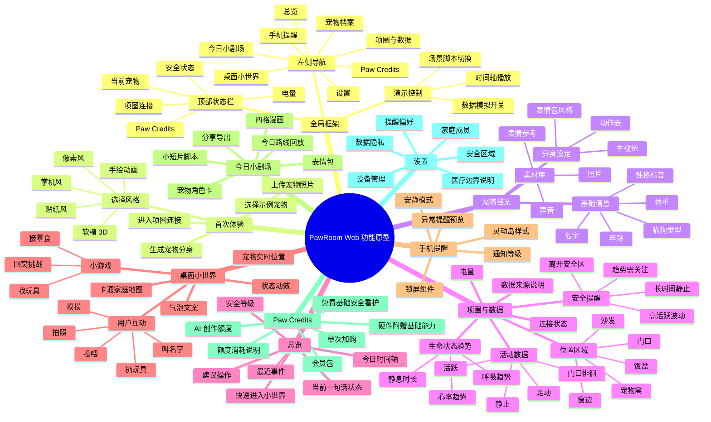
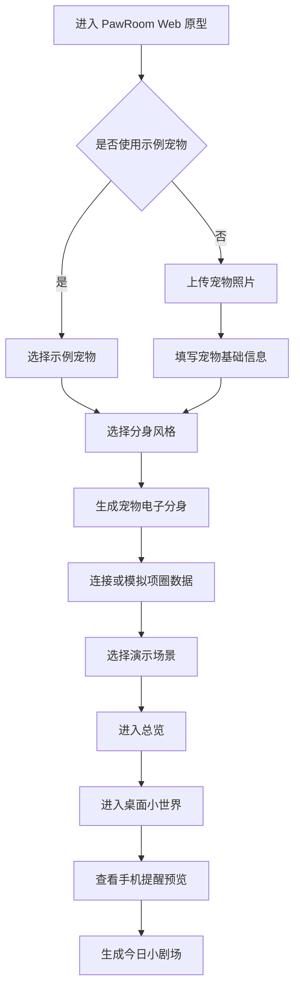
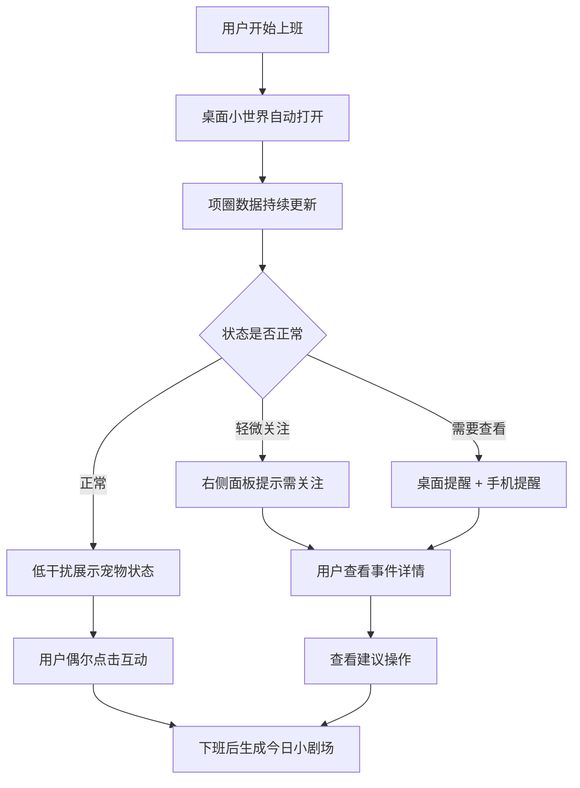
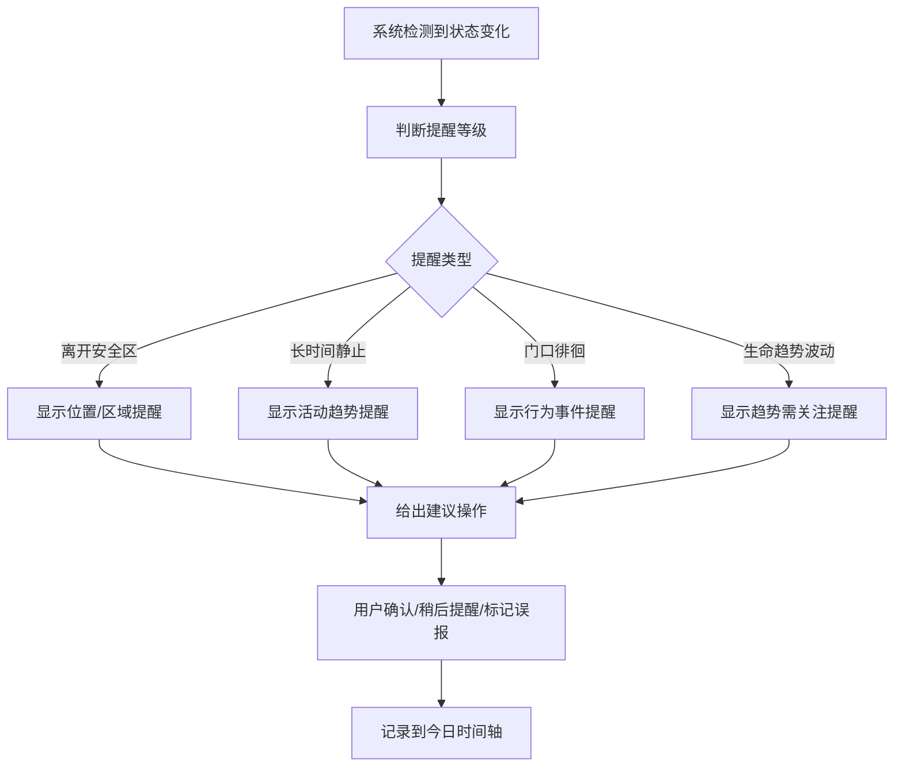
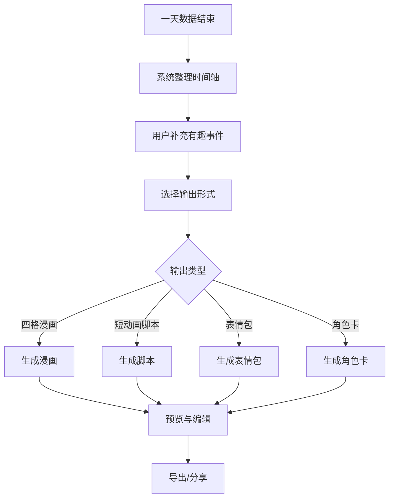
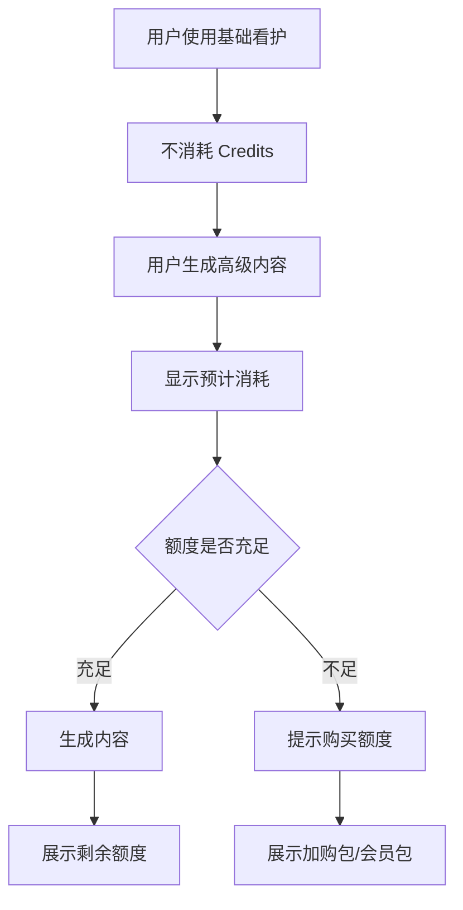

# PawRoom Web 端功能原型信息架构与用户体验流程

版本：v0.1  
日期：2026-07-07  
关联文档：`pawroom-ai-pet-collar-platform-prd-v0.4.md`、`pawroom-software-prototype-development-plan-v0.1.md`  
文档目标：明确 Web 端功能原型的完整范围、信息架构、用户体验流程与 UX 设计原则，保证后续原型既能体现 PawRoom 的差异化，又不制造过高学习成本。

---

## 1. 原型定位

### 1.1 Web 原型不是宣传页

PawRoom 的 Web 端原型首屏应该直接进入可体验的产品，而不是传统品牌落地页。

建议默认入口：

> 一个正在运行的 PawRoom 工作台：左侧是导航，中间是卡通化宠物房间，右侧是宠物安全状态、项圈数据和今日事件。

用户进入后第一眼要理解三件事：

1. 这不是普通桌宠，而是由真实宠物项圈数据驱动的宠物分身。
2. 它首先解决的是上班时远程看护宠物的安全感。
3. 它把冷冰冰的路径、活动和状态数据，变成更容易接受的卡通小世界。

### 1.2 原型需要完整表达最终功能

Web 原型不需要真实接入硬件、真实 AI 生成或真实支付，但需要把最终产品的核心功能链路完整模拟出来：

- 创建宠物档案。
- 上传或选择宠物照片，生成卡通宠物分身。
- 连接或模拟项圈数据。
- 查看宠物安全状态、活动区域、生命状态趋势。
- 在桌面小世界中看到宠物行动。
- 在手机锁屏/灵动岛中看到低干扰提醒。
- 生成今日小剧场、表情包或分享卡片。
- 理解硬件附赠基础软件、AI 创作额度付费的商业逻辑。

### 1.3 原型核心体验句

> 我上班时不用一直打开监控，也能在电脑上看到卡通版的它正在家里做什么；如果它可能有异常，PawRoom 会用低干扰方式提醒我。

---

## 2. 用户心智模型

PawRoom 不应该从零教育用户，而应该借用用户已经熟悉的产品心智，再做一次表达升级。

| 用户熟悉的产品心智 | 用户已经理解的动作 | PawRoom 对应设计 | 学习成本控制 |
| --- | --- | --- | --- |
| 智能项圈 App | 连接设备、看电量、看定位、看活动 | 项圈状态、家庭区域、今日路径、安全提醒 | 保留“设备连接/电量/位置/提醒”等熟悉词 |
| 宠物摄像头 App | 上班时远程看一眼宠物 | 用卡通小世界替代长时间视频监控 | 不要求用户一直盯视频，只看状态摘要 |
| 健康手环 App | 看趋势、看今日状态、看提醒 | 活动趋势、静息趋势、心率/呼吸趋势提示 | 用“趋势”和“需关注”替代医疗化判断 |
| 桌面小组件 | 常驻、轻量、不打扰 | 桌面 PawRoom 小窗 | 默认安静运行，只在异常时强化提醒 |
| 桌宠/养成游戏 | 点击互动、喂食、换场景 | 摸摸、投喂、叫名字、小游戏 | 互动是情感层，不遮挡安全功能 |
| iPhone 灵动岛/锁屏组件 | 简短状态、实时提醒 | 手机端低干扰状态条 | 用一句话告诉用户“它现在大概还好” |

设计原则：

- 先让用户觉得“我知道这是干什么的”，再让用户发现“它比竞品更有意思”。
- 安全看护是主心智，桌宠互动是表达层。
- AI 不是单独的炫技页面，而是贯穿在“分身生成、状态解释、今日小剧场、分享内容”里。

---

## 3. Web 原型信息架构思维导图

### 3.1 v0.2 单页视觉信息架构图

为降低阅读成本，Web 原型的信息架构已重新收敛为 6 个一级模块：宠物创建、项圈与数据、看护首页、桌面小世界、今日回放与创作、我的与设置。手机提醒合并到“桌面小世界”的跨端状态预览中，Paw Credits 合并到“我的与设置”中，硬件项圈只作为数据来源出现。

推荐在汇报和原型设计中优先使用这张单页视觉图：

- SVG 源文件：[pawroom-web-ia-map-v0.2.svg](assets/pawroom-web-ia-map-v0.2.svg)
- PNG 展示图：[pawroom-web-ia-map-v0.2.png](assets/pawroom-web-ia-map-v0.2.png)
- PDF 提交版：[pawroom-web-ia-map-v0.2.pdf](assets/pawroom-web-ia-map-v0.2.pdf)
- 理论审查记录：[pawroom-web-ia-theory-audit-v0.1.md](pawroom-web-ia-theory-audit-v0.1.md)
- 低保真 UX 流程图：[pawroom-web-lowfi-wireflow-v0.1.png](assets/pawroom-web-lowfi-wireflow-v0.1.png)
- 低保真设计说明：[pawroom-web-lowfi-ux-wireflow-v0.1.md](pawroom-web-lowfi-ux-wireflow-v0.1.md)
- 设计系统 v0.1：[pawroom-design-system-v0.1.md](pawroom-design-system-v0.1.md)
- Design Tokens v0.1：[pawroom-design-tokens-v0.1.json](assets/pawroom-design-tokens-v0.1.json)

### 3.2 旧版 Mermaid 结构备查

---

## 4. 推荐导航结构

### 4.1 桌面 Web 导航

建议使用左侧导航，不建议用复杂顶部菜单。原因是 PawRoom 原型需要长期展示“桌面小世界 + 状态面板”，左侧导航更接近工具型工作台，也更适合后续桌面端封装。

一级导航建议：

1. 总览
2. 宠物档案
3. 项圈与数据
4. 桌面小世界
5. 手机提醒
6. 今日小剧场
7. Paw Credits
8. 设置

导航命名要避免技术化：

- 用“项圈与数据”，不要用“传感器中心”。
- 用“桌面小世界”，不要用“虚拟场景引擎”。
- 用“今日小剧场”，不要用“AI 内容生成模块”。
- 用“Paw Credits”，同时在页面内解释为“AI 创作额度”。
- 用“生命状态趋势”，不要用“生命体征诊断”。

### 4.2 页面布局建议

核心体验页面采用三栏结构：

| 区域 | 作用 | 内容 |
| --- | --- | --- |
| 左侧导航 | 保持方向感 | 页面入口、当前宠物、项圈连接状态 |
| 中央主画布 | 展示差异化 | 卡通房间、宠物分身、路径动画、互动动作 |
| 右侧信息面板 | 建立安全感 | 当前状态、数据来源、时间轴、提醒、建议操作 |

这样可以同时满足两类心智：

- 想看宠物的人会先看中央画布。
- 焦虑安全的人会看首页主画布内的状态卡和提醒。

---

## 5. 页面级功能范围

### 5.1 总览页

目的：让用户在 5 秒内知道宠物现在是否安全。

必须展示：

- 宠物当前一句话状态。
- 安全等级：正常、轻微关注、需要查看。
- 项圈连接状态和电量。
- 当前区域：沙发、门口、饭盆、窗边、宠物窝等。
- 今日活动摘要：休息多久、活动多久、是否有异常。
- 最近 3 条事件。
- 进入桌面小世界的主按钮。

推荐文案：

- “豆包正在沙发附近休息，项圈连接正常。”
- “过去 30 分钟活动偏低，可以稍后再看一眼。”
- “门口徘徊时间略长，已记录为需关注事件。”

避免文案：

- “心率异常，可能患病。”
- “系统诊断宠物状态异常。”
- “实时监控宠物一举一动。”

### 5.2 宠物档案页

目的：建立“这是我的宠物”的情感连接。

必须展示：

- 宠物名、类型、年龄、体重。
- 上传照片或选择示例照片。
- 选择视觉风格。
- 生成宠物分身的结果区。
- 分身动作预览：睡觉、走动、跑动、等待、开心、需关注。

MVP 可用预设素材，不必真实生成。

交互重点：

- 上传后显示“正在生成分身”的过程反馈。
- 生成结果可切换风格。
- 允许用户选择“更像一点 / 更可爱一点 / 更像像素游戏一点”的轻量反馈。

### 5.3 项圈与数据页

目的：让用户相信小世界不是凭空编的，而是由项圈数据驱动。

必须展示：

- 项圈连接状态。
- 电量。
- 数据更新时间。
- 今日活动趋势。
- 当前区域判断。
- 生命状态趋势：心率趋势、呼吸趋势、静息时长趋势。
- 数据来源说明：项圈模拟数据、用户补充事件、AI 演绎内容。

体验重点：

- 不把所有数据堆成专业仪表盘。
- 先展示“状态结论”，再允许展开看趋势。
- 每个趋势都要标注“仅作日常看护参考，不作为医疗诊断”。

### 5.4 桌面小世界页

目的：展示 PawRoom 的核心差异化。

必须展示：

- 卡通家庭地图。
- 宠物分身在不同区域移动。
- 根据状态切换动作：睡觉、巡逻、吃饭、等主人、玩耍。
- 简短气泡文案。
- 互动按钮：摸摸、投喂、叫名字、扔玩具、拍照。
- 小窗模式预览：模拟真实桌面常驻窗口。

交互重点：

- 默认低干扰，宠物自己行动。
- 点击互动时给轻反馈，不打断工作流。
- 异常提醒出现时要明显，但不要制造恐慌。

### 5.5 手机提醒页

目的：证明 PawRoom 不只在电脑端存在，也能在移动端提供轻量安全感。

必须展示：

- 手机锁屏组件预览。
- 灵动岛状态预览。
- 普通通知预览。
- 提醒等级设置：安静、标准、强提醒。
- 异常提醒示例。

推荐提醒文案：

- “豆包在门口附近待了 12 分钟。”
- “豆包今天活动比平时少，建议回家后观察一下。”
- “项圈电量低于 20%，记得充电。”

### 5.6 今日小剧场页

目的：把功能价值延伸为情感和分享价值。

必须展示：

- 今日时间轴。
- AI 生成的卡通化故事。
- 四格漫画预览。
- 动态表情包预览。
- 宠物角色卡。
- 分享/导出按钮。

生成逻辑要清楚标注：

- 项圈数据：位置、活动、时间。
- 用户补充：今天拆纸箱、追玩具、等主人。
- AI 演绎：把事实变成可爱小剧场。

### 5.7 Paw Credits 页

目的：解释商业模式，同时避免让用户误以为安全功能被额外收费。

必须展示：

- 购买硬件后，基础安全看护和桌面小世界可用。
- Paw Credits 用于高频 AI 创作。
- 安全提醒、项圈状态、基础路径展示不消耗 Credits。
- 消耗 Credits 的场景：高清分身生成、四格漫画、短动画、表情包批量生成、周报故事。

建议定价表达：

- 硬件：项圈购买后附赠基础软件。
- 基础软件：安全看护、状态提醒、桌面小世界基础互动。
- AI 创作额度：用于内容生成和高级视觉输出。

### 5.8 设置页

目的：降低隐私、安全和医疗边界风险。

必须展示：

- 安全区域设置。
- 提醒偏好。
- 数据隐私说明。
- 医疗边界说明。
- 家庭成员共享。
- 设备管理。

医疗边界必须明确：

> PawRoom 展示的是日常看护趋势和状态提醒，不提供医疗诊断。如宠物持续异常，请咨询兽医。

---

## 6. 核心用户体验流程

### 6.1 首次体验流程

体验要求：

- 新用户必须能在 2 分钟内走完一遍。
- 如果用户没有真实宠物素材，必须能用示例宠物体验。
- 每一步只出现一个主任务，不让用户同时理解太多概念。

### 6.2 日常上班使用流程

体验要求：

- 正常状态不抢用户注意力。
- 轻微关注不使用恐吓式红色。
- 需要查看时必须说明原因、数据来源和建议动作。

### 6.3 安全提醒流程

建议操作要具体但克制：

- “可以打开摄像头确认一下。”
- “可以稍后再观察 10 分钟。”
- “如果持续出现，请联系兽医。”
- “这不是诊断，仅是趋势提醒。”

### 6.4 今日小剧场生成流程

体验要求：

- 用户必须能修改 AI 文案。
- 输出内容要标注“基于今日数据演绎”。
- 分享卡片不暴露家庭精确位置和敏感数据。

### 6.5 Paw Credits 付费理解流程

付费认知要清晰：

- 安全看护不被 Credits 卡住。
- AI 创作消耗 Credits。
- 用户每次生成前知道消耗多少。
- 失败生成不扣额度，或明确说明重试规则。

---

## 7. 关键页面原型顺序

如果时间有限，建议按以下顺序制作页面。这个顺序最适合 2 天内交付可讲清楚的原型。

| 优先级 | 页面 | 目的 | 是否必须 |
| --- | --- | --- | --- |
| P0 | 总览页 | 建立安全看护主价值 | 必须 |
| P0 | 桌面小世界页 | 展示核心差异化 | 必须 |
| P0 | 项圈与数据页 | 证明数据来源可信 | 必须 |
| P0 | 宠物档案/分身生成页 | 建立个体化情感连接 | 必须 |
| P0 | 手机提醒页 | 展示跨端低干扰看护 | 必须 |
| P1 | 今日小剧场页 | 展示 AI 内容衍生价值 | 建议 |
| P1 | Paw Credits 页 | 解释商业模式 | 建议 |
| P1 | 设置页 | 处理隐私、提醒、医疗边界 | 建议 |
| P2 | 多宠物管理 | 扩展能力 | 可后置 |
| P2 | 真实登录/支付 | 工程能力 | 不建议做进 2 天 MVP |

---

## 8. 体验设计手则

### 8.1 安全第一，趣味第二

PawRoom 的付费理由来自“我想知道宠物是否安全”，不是单纯“我想要一个可爱桌宠”。

因此页面优先级应为：

1. 宠物现在是否安全。
2. 数据来自哪里。
3. 它现在大概在做什么。
4. 我可以如何互动。
5. 我可以生成什么有趣内容。

### 8.2 先给结论，再给数据

用户不想先看复杂曲线。建议每个数据模块都采用三层结构：

1. 一句话结论：豆包今天活动正常。
2. 关键依据：过去 1 小时主要在沙发和饭盆附近。
3. 展开数据：活动趋势、区域时间、生命状态趋势。

### 8.3 明确区分事实和 AI 演绎

PawRoom 的核心风险是用户误以为 AI 演绎等于真实行为。

界面中需要区分三类信息：

- 项圈记录：来自设备数据。
- 用户补充：来自主人输入。
- AI 演绎：为了可爱和分享生成的内容。

例如：

> 项圈记录：14:20 在门口附近活动。  
> AI 演绎：豆包像是在等待主人回家。

### 8.4 不制造监控压力

竞品中的摄像头产品会让用户形成“必须看画面才放心”的心智。PawRoom 应该反过来强调低干扰：

- 正常时只显示轻量状态。
- 异常时给原因和建议。
- 不把宠物行为描述得过度拟人或过度确定。
- 不让用户觉得自己必须全天盯着屏幕。

### 8.5 保持可爱，但不幼稚

PawRoom 需要既有情绪价值，又要承载安全看护。因此视觉和文案不能只卖萌。

建议：

- 色彩温暖但信息层级清楚。
- 动效轻快但不遮挡状态信息。
- 表情和气泡文案短，不刷屏。
- 警示状态使用克制的暖色，而不是强烈恐吓式红色。

### 8.6 对异常保持克制

生命状态趋势相关文案必须避免医疗化判断。

可用表达：

- “趋势略有波动。”
- “建议稍后观察。”
- “如持续出现，请咨询兽医。”
- “仅作日常看护参考。”

避免表达：

- “疑似疾病。”
- “心率异常。”
- “系统判断宠物生病。”
- “医疗级监测。”

### 8.7 降低新用户学习成本

具体做法：

- 默认提供示例宠物和示例项圈数据。
- 每页只放一个主按钮。
- 用熟悉词：宠物、项圈、状态、位置、提醒、今日回放。
- 对新概念做页内解释，不开长篇说明页。
- 不把“AI、传感器、Token、模型”等概念放在主路径上。

### 8.8 每个状态都要有反馈

用户需要知道系统正在做什么：

- 上传照片时显示进度。
- 生成分身时显示阶段。
- 项圈数据更新时显示更新时间。
- AI 生成内容时显示预计消耗 Credits。
- 异常提醒被确认后显示已记录。

### 8.9 尊重桌面工作场景

桌面端要适合用户上班时打开：

- 默认不自动播放大音效。
- 常驻窗口不遮挡主要工作区域。
- 动效节奏慢，不闪烁。
- 提醒可以延后、静音、标记已读。
- 支持小窗模式预览。

### 8.10 可访问性和响应式基本要求

Web 原型即使是 MVP，也要满足基本体验质量：

- 按钮点击区域不小于 44px。
- 关键文字对比度足够。
- 图表不只依赖颜色区分。
- 重要按钮有清晰悬停和聚焦状态。
- 加载中保留空间，避免页面跳动。
- 移动预览页面不能横向滚动。
- 对动效敏感用户可关闭高频动画。

---

## 9. 与竞品的关联和差异

| 竞品类型 | PawRoom 应继承的心智 | PawRoom 必须做出的差异 |
| --- | --- | --- |
| Tractive / Fi 等定位项圈 | 位置、活动、安全区、电量、提醒 | 不只展示地图和数据，而是变成宠物小世界 |
| PetPace / Invoxia 等健康监测 | 趋势、持续记录、需关注提醒 | 不做医疗诊断，只做日常看护解释 |
| Furbo / Petcube 等摄像头 | 上班远程安心、异常提醒 | 不以视频监控为中心，降低盯屏压力 |
| 桌宠/桌面小组件 | 常驻陪伴、轻交互、可爱动效 | 不是虚构宠物，而是由真实宠物数据驱动 |
| AI 图片/视频生成工具 | 照片风格化、内容生成 | 不止一次性生成图片，而是围绕每天生活形成循环 |

一句话竞争定位：

> 竞品多在“采集和展示数据”，PawRoom 做的是“把数据变成主人愿意每天看的宠物第二现场”。

---

## 10. MVP 演示脚本建议

建议 Web 原型内置 4 个可切换脚本，方便汇报时一键演示不同状态。

### 10.1 安静日

适合证明低干扰陪伴：

- 宠物大部分时间在沙发和宠物窝。
- 活动正常。
- 生命状态趋势正常。
- 桌面小世界展示睡觉、伸懒腰、慢慢走动。
- 今日小剧场生成“偷懒冠军的一天”。

### 10.2 活跃日

适合证明趣味和内容生成：

- 宠物频繁在玩具区、窗边、饭盆活动。
- 小世界展示跑动和玩玩具。
- 今日小剧场生成四格漫画和表情包。

### 10.3 等主人日

适合证明情绪价值：

- 宠物多次在门口附近停留。
- 右侧面板显示“门口停留时间较长”。
- 桌面宠物出现等待动作。
- 手机提醒显示“它可能在门口等你”。

### 10.4 需关注日

适合证明安全付费理由：

- 长时间静止或活动明显低于平时。
- 生命状态趋势出现轻微波动。
- 系统给出“建议稍后观察/打开摄像头确认/持续异常咨询兽医”。
- 今日时间轴记录需关注事件。

---

## 11. 验收清单

Web 原型完成后，用以下清单检查：

- 是否一眼能看出 PawRoom 是宠物安全看护 + 桌面小世界？
- 是否先讲清安全状态，再展示互动玩法？
- 是否能完整走通“宠物照片 -> 分身 -> 项圈数据 -> 小世界 -> 手机提醒 -> 今日小剧场”？
- 是否明确区分项圈记录、用户补充和 AI 演绎？
- 是否避免医疗诊断式表达？
- 是否说明安全看护不消耗 Paw Credits？
- 是否保留用户熟悉的项圈、电量、位置、提醒、趋势等竞品心智？
- 是否没有把用户逼进复杂设置和专业数据面板？
- 是否提供示例宠物，方便评审快速体验？
- 是否能在 2 分钟内完成首次体验？

---

## 12. 后续原型制作建议

建议下一步直接按以下顺序进入 Web 原型制作：

1. 先做总览页和桌面小世界页，建立产品第一印象。
2. 再做项圈与数据页，补足可信度。
3. 再做宠物档案页，补足个体化入口。
4. 再做手机提醒页，补足跨端叙事。
5. 最后做今日小剧场和 Paw Credits 页，补足情绪价值和商业模式。

如果只能展示 5 个页面，建议选择：

1. 总览页。
2. 宠物档案/分身生成页。
3. 项圈与数据页。
4. 桌面小世界页。
5. 手机提醒 + 今日小剧场组合页。

这 5 个页面已经足够讲清 PawRoom 的完整闭环。
