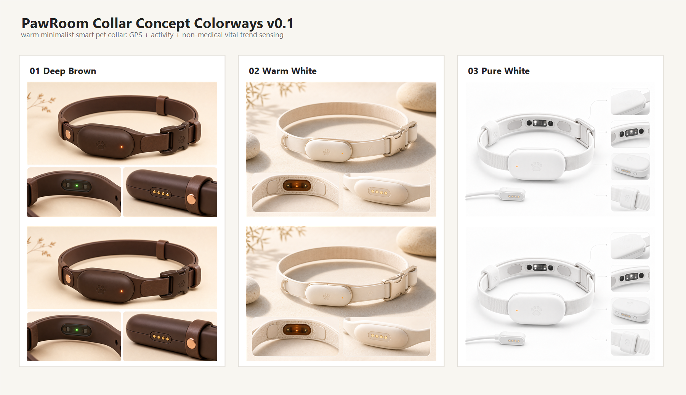

# PawRoom Collar 硬件产品设计交付索引 v0.1

日期：2026-07-08

## 1. 本次交付

- 硬件构成与实现规划：[pawroom-collar-hardware-design-v0.1.md](./pawroom-collar-hardware-design-v0.1.md)
- 外观效果图提示词：[pawroom-collar-imagegen-prompts-v0.1.md](./pawroom-collar-imagegen-prompts-v0.1.md)
- 三套硬件效果图：
  - 深棕色：[pawroom-collar-concept-v01-deep-brown.png](./assets/pawroom-collar-concept-v01-deep-brown.png)
  - 暖白色：[pawroom-collar-concept-v01-warm-white.png](./assets/pawroom-collar-concept-v01-warm-white.png)
  - 纯白色：[pawroom-collar-concept-v01-pure-white.png](./assets/pawroom-collar-concept-v01-pure-white.png)
- 三色对比图：[pawroom-collar-concept-v01-colorways-contact-sheet.png](./assets/pawroom-collar-concept-v01-colorways-contact-sheet.png)

## 2. 设计判断

PawRoom Collar 不建议直接对标“医疗级健康项圈”或“最强 GPS 项圈”。更合理的产品心智是：

> 宠物安全看护硬件底座 + PawRoom 桌宠小世界的数据入口。

硬件负责可信采集：

- GPS / GNSS 户外定位
- 安全围栏提醒
- 活动状态与静息趋势
- 心率、呼吸、皮温的非医疗趋势
- 电量、佩戴、连接、数据置信度

软件负责体验转译：

- 工作时低干扰查看
- 桌面小世界状态演绎
- 异常轻提醒
- 今日小剧场与回放创作

## 3. 使用建议

汇报材料里建议用以下顺序：

1. 先放一句定位：PawRoom Collar 是安全看护与桌宠体验的数据底座。
2. 再放硬件爆点：定位、活动、生命趋势、数据置信度。
3. 接着放三色效果图，表达温暖简洁的硬件气质。
4. 最后强调边界：生命状态为趋势提醒，不替代医疗诊断。

## 4. 效果图预览

