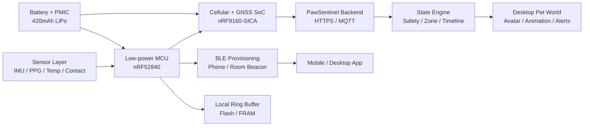

# PawSentinel Collar S1 硬件产品架构说明 v0.2

版本：v0.2
日期：2026-07-08
状态：PawSentinel Collar S1 参考硬件架构 / Alpha 原型规格
产品定位：面向家庭宠物安全看护的智能项圈硬件底座，为 PawSentinel 软件端提供活动、位置、电量、佩戴和生命趋势数据。

> 对外介绍口径：PawSentinel Collar S1 是 PawSentinel 软硬件系统的数据入口。它不做医疗诊断，而是通过定位、活动识别、佩戴检测和非医疗生命趋势采集，把宠物独自在家时的安全状态转译为桌面端可理解、可互动、可提醒的宠物小世界。

## 1. 产品定位

PawSentinel Collar S1 不是单纯的 GPS 项圈，也不是医疗级监护设备。它的目标是成为宠物安全看护系统中的“高可信数据采集层”：

- 采集宠物在家中的大致活动区域、运动状态和休息趋势。
- 监测项圈电量、佩戴状态、连接状态和数据可信度。
- 在静息且接触良好的条件下采集心率、呼吸、皮温等非医疗趋势信号。
- 在外出或丢失场景下切换到 GNSS + 蜂窝定位链路。
- 将低层硬件数据传给后端状态引擎，再由软件端呈现为安全提醒、桌面宠物分身动作和今日历程。

核心差异不是“比专业宠物医疗项圈更准”，而是：

```text
Smart collar telemetry -> safety state engine -> personalized desktop pet world
智能项圈数据 -> 安全状态引擎 -> 专属宠物桌面小世界
```

## 2. 系统组成

PawSentinel Collar S1 由三部分构成：

| 模块 | 形态 | 作用 |
| --- | --- | --- |
| Collar S1 主机 | 可拆卸智能项圈主机 | 传感器采集、定位、通信、电源管理、数据缓存 |
| Comfort Strap | 亲肤可替换项圈带 | 佩戴固定、压力分散、防水清洁、尺寸适配 |
| Magnetic Dock | 磁吸充电底座 | 5V 磁吸充电、桌面待机、家庭 BLE 信标辅助 |

可选扩展：

| 扩展 | 作用 |
| --- | --- |
| Room Beacon H1 | 放在客厅、门口、食盆等区域，用 BLE RSSI 辅助判断室内大致区域 |
| Mobile App / Desktop App | 设备绑定、状态查看、提醒设置、固件升级、桌面宠物世界 |

## 3. 硬件总架构



设计原则：

- 高频数据在项圈端先做低功耗预处理，不把原始传感器流全部上传。
- 安全看护数据优先使用规则和状态机，避免高频 AI 消耗。
- 生命相关数据只表达趋势和可信度，不承诺医疗级精度。
- 桌面宠物分身由用户上传宠物照片/素材后通过 AI 工作流生成，项圈只负责驱动状态和行为。

## 4. 核心器件选型

### 4.1 主控与通信

| 子系统 | 推荐器件 | 选择理由 |
| --- | --- | --- |
| 蜂窝 + GNSS | Nordic nRF9160-SICA | 集成 LTE-M / NB-IoT / GNSS，适合低功耗可穿戴和宠物定位设备 |
| BLE + 低功耗协处理 | Nordic nRF52840 | BLE 5.3、低功耗、生态成熟，负责近场绑定、传感器调度和本地状态机 |
| 外部 Flash | Winbond W25Q128JV 128Mbit | 存储离线数据、固件包、异常片段和事件缓存 |
| 安全芯片 | Microchip ATECC608B | 设备身份、TLS 私钥保护、云端注册和防伪校验 |

架构说明：

- nRF52840 作为常驻低功耗控制器，负责 IMU、PPG、皮温、佩戴检测和 BLE。
- nRF9160 只在需要蜂窝上传、GNSS 定位或离家模式时被唤醒，降低日常功耗。
- 两颗芯片通过 UART + GPIO 中断通信，数据包采用 protobuf-like 二进制帧或紧凑 JSON 帧。

### 4.2 运动、佩戴和生命趋势传感

| 子系统 | 推荐器件 | 采集内容 | 说明 |
| --- | --- | --- | --- |
| 6 轴 IMU | Bosch BMI270 | 静止、走动、奔跑、抖动、睡眠姿态、异常高活动 | P0 核心器件，功耗低，运动识别稳定 |
| PPG 光学传感 | Maxim MAX30101 / MAX86141 AFE | 静息心率趋势、脉搏波变化、呼吸趋势辅助 | 仅在接触良好且低活动时采样 |
| 皮温传感 | TI TMP117 | 贴肤温度趋势 | 不等同核心体温，只做相对变化提醒 |
| 接触检测 | ADI AD7147 电容触摸控制器 + 双接触电极 | 判断是否佩戴、传感窗是否贴合 | 给每条生命趋势数据附加可信度 |
| 环境传感 | Bosch BME280 | 环境温湿度、气压上下文 | 用于解释皮温和休息状态变化 |
| 触觉/声光反馈 | Coin vibration motor + micro LED | 找回提示、低电量提示、绑定状态 | 默认低干扰，不惊吓宠物 |

生命趋势策略：

- 心率趋势：PPG 静息采样，采样窗口 20-45 秒。
- 呼吸趋势：静息状态下由 IMU 微动 + PPG 低频波动联合估计。
- 皮温趋势：以贴肤温度变化为主，结合环境温度做补偿。
- 可信度：由运动强度、佩戴接触、电极贴合、毛发干扰和采样窗口共同决定。

## 5. 结构与工业设计

### 5.1 结构堆叠

PawSentinel Collar S1 采用“外侧主控舱 + 内侧柔性传感窗 + 可拆换项圈带”的结构。

| 结构层 | 材料 / 工艺 | 功能 |
| --- | --- | --- |
| 外壳上盖 | PC + ABS，微磨砂 UV 涂层 | 抗刮、耐汗液、隐藏天线区域 |
| 外壳底壳 | PC + 玻纤增强，超声波焊接 | 固定 PCB、电池和密封圈 |
| 内侧传感窗 | 医疗级硅胶包覆 + 半透明光学窗口 | 贴合皮肤，承载 PPG / 皮温 / 接触检测 |
| 项圈带 | TPU + 尼龙织物复合 | 防水、耐拉伸、亲肤、可拆洗 |
| 扣具 | POM 快拆扣 + 316L 不锈钢轴 | 防卡脖、可快速释放 |
| 充电触点 | 316L 不锈钢 Pogo Pin / 镀金触点 | 磁吸充电，防汗液腐蚀 |
| 密封 | LSR 硅胶密封圈 + 纳米防水涂层 | 目标 IP67 |

### 5.2 尺寸与重量目标

| 项目 | 目标规格 |
| --- | --- |
| 主机尺寸 | 54 mm x 28 mm x 13 mm |
| 主机重量 | 28-36 g |
| 整机重量 | 小号 42 g / 中号 52 g / 大号 62 g |
| 电池容量 | 420 mAh 异形软包锂电 |
| 防护等级 | IP67 日常防水、防雨、防泼溅、可擦洗 |
| 适配宠物 | 猫、小型犬、中型犬；大型犬可使用加长项圈带 |

### 5.3 外观语言

设计气质：高端、温暖、低监控感、像宠物日用品而不是冷硬设备。

推荐三套 CMF：

| 配色 | 主色 | 辅色 | 气质 |
| --- | --- | --- | --- |
| Warm Ivory | #F4E8D7 | 柔橙指示灯、浅金触点 | 温暖、亲肤、适合猫狗通用 |
| Cocoa Brown | #4A2A1A | 暖铜按钮、深咖啡织带 | 高端、耐脏、像皮具 |
| Clean White | #FFFFFF | 雾银、浅灰、柔橙 LED | 科技、干净、轻量 |

## 6. 电源系统

| 子系统 | 推荐器件 | 说明 |
| --- | --- | --- |
| 充电与 PMIC | TI BQ25120A | 低功耗穿戴设备 PMIC，支持充电、电源路径和降压输出 |
| 电量计 | Maxim MAX17048 | 电池电量估算，支持低功耗 fuel gauge |
| 电池保护 | Seiko S-8261 / 同类保护 IC | 过充、过放、过流保护 |
| 电池 | 420 mAh 3.8V LiPo 异形软包 | 兼顾体积和续航 |
| 充电 | 5V 磁吸触点，300-500mA 限流 | 目标 90 分钟充至 80% |

续航目标：

| 模式 | 数据策略 | 目标续航 |
| --- | --- | --- |
| 家庭日常看护 | BLE + IMU 常驻，PPG 间歇，蜂窝休眠 | 5-7 天 |
| 外出散步 | GNSS 1-5 分钟间隔，蜂窝批量上传 | 2-4 天 |
| 丢失模式 | GNSS 10-15 秒间隔，蜂窝高频回传 | 8-24 小时 |
| 低电保护 | 只保留 BLE / 低频定位 / 找回提示 | 24 小时保底 |

## 7. 定位与区域识别

### 7.1 室外定位

技术组合：

- GNSS：GPS / BeiDou / Galileo / GLONASS 多星座定位。
- 蜂窝：LTE-M / NB-IoT，市场不支持时可切换 Cat.1 版本。
- 安全围栏：云端地理围栏 + 设备端最后安全区域缓存。

策略：

- 日常模式：低频 GNSS，节省电量。
- 离家模式：提高 GNSS 频率，记录散步轨迹。
- 丢失模式：蜂窝持续回传，启用蜂鸣/LED/震动找回。

### 7.2 室内大致区域

PawSentinel 不承诺厘米级室内定位，采用“大致区域 + 可信度”的表达：

| 输入 | 作用 |
| --- | --- |
| BLE Room Beacon RSSI | 判断靠近客厅、门口、食盆、床窝等区域 |
| 手机 / 电脑 BLE 接近 | 判断主人在家或附近 |
| Charging Dock 信标 | 判断宠物是否在固定家庭区域附近 |
| IMU 活动模式 | 辅助判断睡觉、玩耍、门口徘徊、长时间静止 |
| 后端状态引擎 | 结合历史路径输出 `zoneId` 和 `confidence` |

输出示例：

```json
{
  "zoneId": "sofa",
  "zoneLabel": "客厅沙发附近",
  "confidence": 0.78,
  "source": ["ble_rssi", "imu_pattern", "history_prior"]
}
```

## 8. 固件与数据链路

### 8.1 固件架构

推荐固件栈：

- OS：Zephyr RTOS
- BLE：Nordic SoftDevice / Zephyr Bluetooth Host
- 蜂窝：nRF Connect SDK LTE Link Controller
- 云通信：HTTPS / MQTT over TLS
- OTA：MCUboot 双分区固件升级
- 本地缓存：Flash ring buffer，至少保存 7 天摘要事件

固件任务：

| 任务 | 周期 | 说明 |
| --- | --- | --- |
| IMU Sampling | 25 Hz active / 1.6 Hz idle | 活动识别和静息判断 |
| PPG Session | 静息触发，20-45 秒窗口 | 心率/呼吸趋势采样 |
| Skin Temp | 0.2 Hz | 贴肤温度趋势 |
| Battery Monitor | 5 分钟 | 电量、电压、充电状态 |
| BLE Sync | 手机靠近或桌面端在线 | 低功耗近场同步 |
| GNSS Fix | 1-5 分钟 / 丢失模式 10-15 秒 | 室外定位 |
| Cloud Upload | 事件触发 + 批量上传 | 减少蜂窝功耗 |

### 8.2 设备数据包

设备上报给后端的最小数据单元：

```ts
type CollarTelemetryPacket = {
  deviceId: string
  petId: string
  firmwareVersion: string
  timestamp: string
  battery: {
    percent: number
    charging: boolean
    estimatedHours: number
  }
  connectivity: {
    transport: 'ble' | 'lte_m' | 'nb_iot' | 'cat1'
    rssi?: number
    online: boolean
  }
  location: {
    mode: 'indoor_zone' | 'gnss' | 'unknown'
    zoneId?: 'sofa' | 'door' | 'bowl' | 'bed' | 'window' | 'toy_area'
    lat?: number
    lng?: number
    accuracyMeters?: number
    confidence: number
  }
  activity: {
    level: 'low' | 'medium' | 'high'
    motionHint: 'still' | 'walking' | 'running' | 'pacing'
    restingMinutesToday: number
  }
  vitalsTrend: {
    contactQuality: 'good' | 'fair' | 'poor'
    heartRateTrend?: 'normal' | 'slightly_high' | 'slightly_low'
    respirationTrend?: 'normal' | 'slightly_high' | 'slightly_low'
    skinTempTrend?: 'normal' | 'slightly_high' | 'slightly_low'
  }
}
```

后端不会直接把原始数据展示给用户，而是转换成：

- `safe / watch / attention` 安全等级
- `sleeping / resting / walking / playing / needs_attention` 宠物状态
- 桌面宠物分身动画指令
- 时间线事件
- 低电量、断连、长时间静止、门口徘徊等提醒

## 9. 数据可信度与边界

PawSentinel Collar S1 每条关键数据都需要带 `confidence`：

| 情况 | 处理 |
| --- | --- |
| 佩戴良好 + 静息 | 可显示心率/呼吸/皮温趋势 |
| 运动中 + 接触不稳定 | 降级为活动状态，不展示生命趋势 |
| 项圈松动 | 提醒用户调整佩戴 |
| 室内 BLE 信号弱 | 显示“大致区域”，不显示精确路径 |
| 蜂窝离线 | 本地缓存，恢复后补传 |

绝对不能对外承诺：

- 诊断疾病
- 医疗级心率
- 医疗级呼吸
- 精确体温
- GPS 室内精准定位
- 实时识别宠物全部行为

建议表达：

- 生命状态趋势
- 非医疗健康参考
- 安全状态提醒
- 室内大致区域
- 佩戴与数据可信度
- 基于项圈数据的桌面宠物状态演绎

## 10. 与软件端的交互关系

PawSentinel 软件端有两条核心 AI / 数据链路：

### 10.1 宠物分身生成

用户上传自己的宠物照片、声音或素材图，软件端通过 AI 图像工作流生成卡通化、像素化的专属宠物分身。这个流程发生在软件端或云端，不由项圈执行。

输出：

- 像素风宠物头像
- 桌面小世界角色立绘
- 表情包素材
- 角色卡
- 可选的漫画/记忆卡片

### 10.2 项圈数据驱动

项圈持续提供状态数据，后端状态引擎把数据转换为桌面小世界行为：

| 项圈数据 | 后端状态 | 桌面表现 |
| --- | --- | --- |
| 客厅区域 + 低活动 + 静息趋势正常 | `resting / safe` | 宠物分身在沙发睡觉 |
| 门口区域 + pacing + 主人不在家 | `waiting / watch` | 宠物分身在门边等待 |
| 长时间静止 + 接触良好 + 趋势异常 | `needs_attention / attention` | 轻提醒用户查看 |
| 电量低于 20% | `low_battery / watch` | 桌面电量卡片和移动端提醒 |
| 项圈断连 | `offline / watch` | 桌面世界进入弱提示离线态 |

## 11. 生产与验证计划

### EVT 工程验证

目标：验证主板、电源、传感器采集和通信链路。

- nRF52840 + nRF9160 开发板联调。
- IMU / PPG / 皮温 / 接触检测采样。
- 磁吸充电和电量计验证。
- BLE 绑定、蜂窝上传、GNSS 定位验证。
- 模拟宠物运动数据，校准状态机。

### DVT 设计验证

目标：验证项圈形态、佩戴、密封和数据质量。

- 3D 打印外壳 + TPU 软带。
- 传感窗贴合压力测试。
- IP67 防水结构验证。
- 小型犬/猫假体佩戴测试。
- 室内 BLE 区域识别测试。

### PVT 小批验证

目标：验证 20-50 台小批样机稳定性。

- 7 天续航测试。
- 低电量和断连提醒测试。
- 丢失模式功耗测试。
- 固件 OTA 测试。
- 桌面端状态演绎一致性测试。

## 12. 汇报用高端表达

可直接用于 PPT 或 GitHub 文档：

> PawSentinel Collar S1 采用双芯片低功耗架构：nRF52840 负责 BLE、传感器调度和本地状态机，nRF9160-SICA 负责 LTE-M / NB-IoT / GNSS 远程连接。项圈内侧集成 PPG 光学传感、皮温、接触检测和 6 轴 IMU，外侧主控舱承载电池、天线、安全芯片和磁吸充电结构。设备端先把高频传感数据压缩为低功耗状态事件，再由后端状态引擎转换为安全等级、活动区域、时间线和桌面宠物分身动画指令。整个系统强调非医疗生命趋势、佩戴可信度和低干扰陪伴体验，让宠物安全看护不再只是摄像头监控，而是一个可理解、可互动、可持续使用的桌面宠物世界。

## 13. 参考器件链接

- Nordic nRF9160: https://www.nordicsemi.com/Products/nRF9160
- Nordic nRF52840: https://www.nordicsemi.com/Products/nRF52840
- Bosch BMI270: https://www.bosch-sensortec.com/products/motion-sensors/imus/bmi270/
- Maxim MAX30101: https://www.analog.com/en/products/max30101.html
- TI TMP117: https://www.ti.com/product/TMP117
- TI BQ25120A: https://www.ti.com/product/BQ25120A
- Maxim MAX17048: https://www.analog.com/en/products/max17048.html
- Microchip ATECC608B: https://www.microchip.com/en-us/product/ATECC608B
